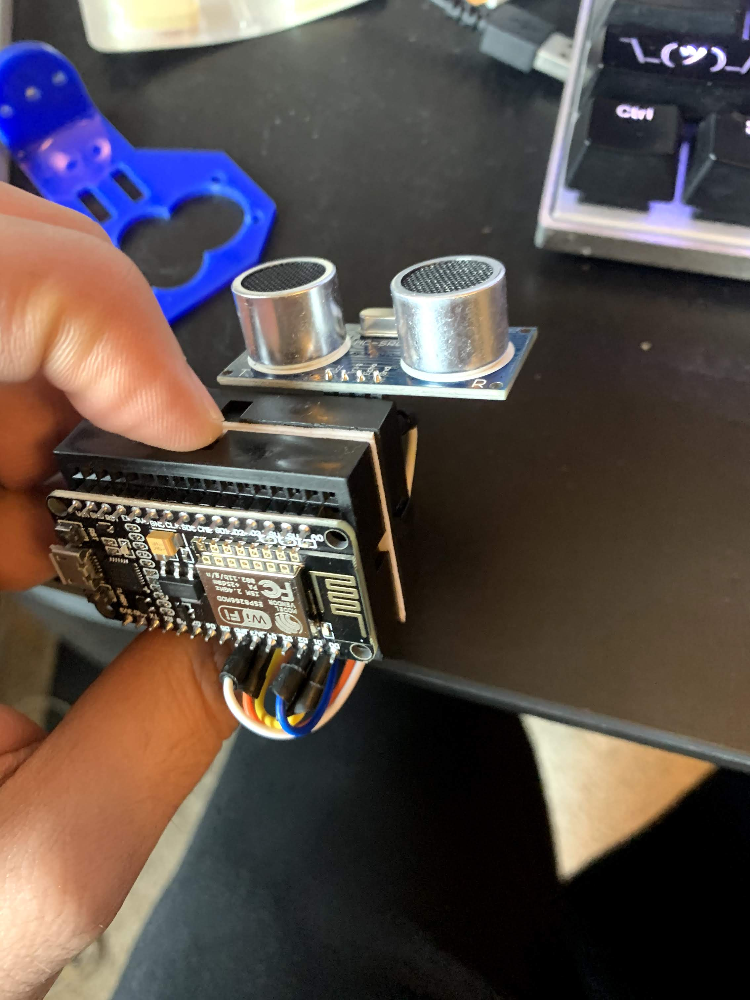
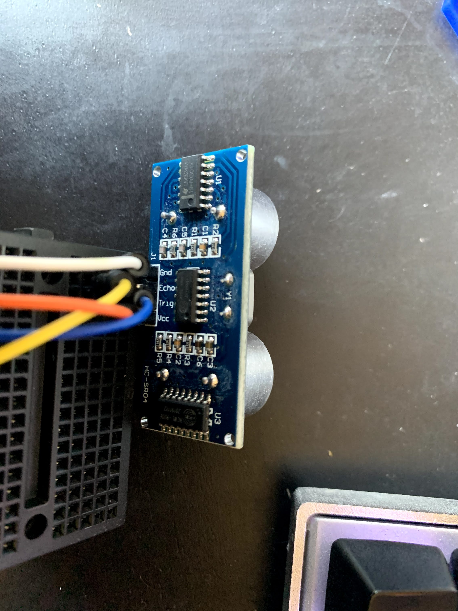
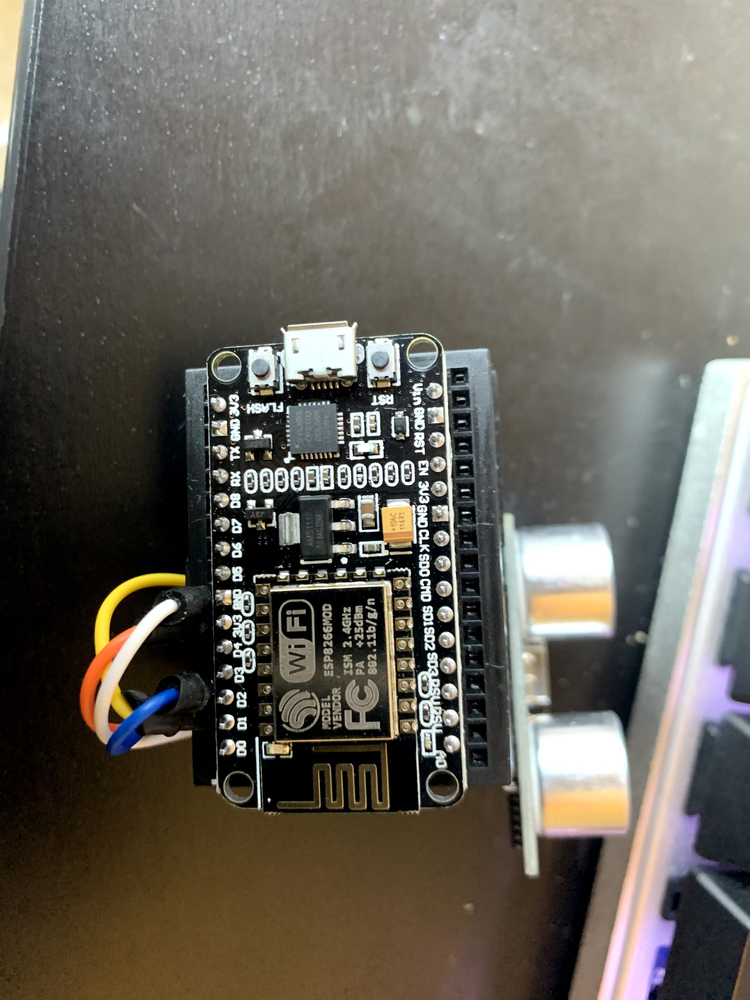
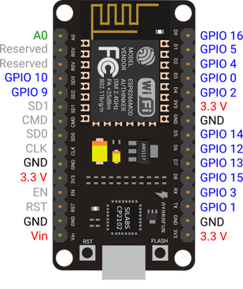
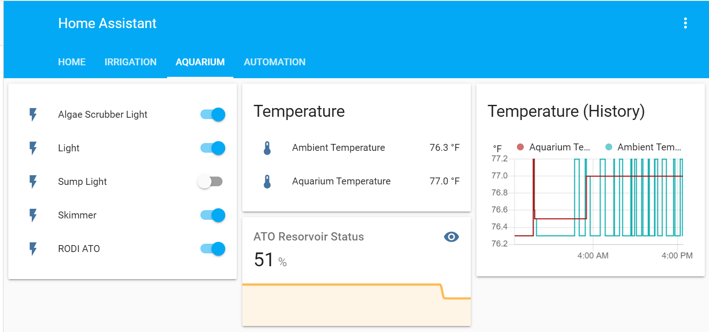

# ArduinoDistanceMeterMQTT

## Arduino Requirements
 - Hardware: NodeMCU v2 ESP8266
 - Hardware: HC-SR04P 3.3v
 - Breadboard, Wire, misc supplies

### Wiring Pinout
 - HC-SR04P
   - vcc > NodeMCU 3v3
   - trig > NodeMCU D2
   - echo > NodeMCU D1
   - gnd > NodeMCU GND

### Images

**Bread Board**

**HC-SR04, this should be HC-SR04p as NodeMCUv2 does not support 5v sensors**

**NodeMCU**

**NodeMCU Diagram**

**HASS Sensor Image**

